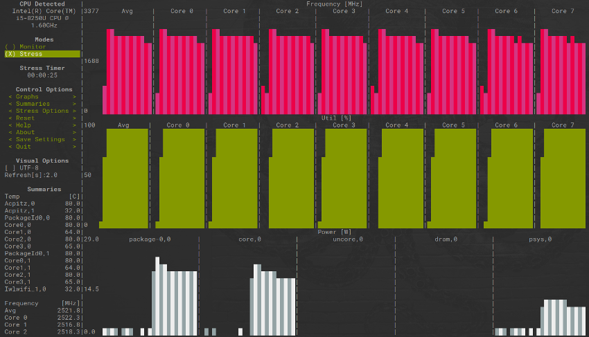

# Linux on Xiaomi Mibook Air 13" Laptop

Some notes from setting up ElementaryOS on a Xiaomi Mibook Air 13 laptop. 

<p align="center">
  
</p>
 
## Mibook Air 13 Laptop

The [Xiaomi Mibook Air 13](https://www.mi.com/mibook/air13-2019?product_id=2191200007) is not a new machine but is often referenced as a good candidate for a poor man's MacBook Pro. You can read the online reviews to judge for yourself the pros and cons.

My only complaint would be the integrated webcam, it's terrible. For others, the lack of warranty coverage and support outside of China can be an issue. Some have complained that activating Windows 10 can only be done in Chinese language, but that's not something i'm worried about here :)

## ElementaryOS

The Mibook Air is a 'good looking' machine, IMHO. Hadn't used [ElementaryOS](https://elementary.io) before but wanted to explore installing a minimalist and equally 'good looking' Linux desktop environment. Elementary's Pantheon (written in Vala and uses GTK3) desktop definitely caught my eye.  

Installed ElementaryOS 5.1.5 Hera. Not sure i'll continue to run Elementary but, since through my shallowness I installed it based only its looks, i've got to say it does look great on the Mibook Air!     

## Installation Notes

Enter BIOS settings using **F2** key at boot. 

BIOS for the Mibook 13's TM1703 motherboard is Insyde Corp. Version XMAKB3M0P1810. 

BIOS menu all in English of course (don't worry!)

<p align="center">
  
</p>

Enable option to boot from USB and check boot sequence.  

## Xiaomi Mibook Hardware

Extract of SMBIOS from ```dmidecode -q```

```
BIOS Information
	Vendor: Insyde Corp.
	Version: XMAKB3M0P1810
	Release Date: 02/05/2020
	Address: 0xE0000
	Runtime Size: 128 kB
	ROM Size: 8192 kB
	Characteristics:
		PCI is supported
		BIOS is upgradeable
		BIOS shadowing is allowed
		Boot from CD is supported
		Selectable boot is supported
		EDD is supported
		8042 keyboard services are supported (int 9h)
		CGA/mono video services are supported (int 10h)
		ACPI is supported
		USB legacy is supported
		BIOS boot specification is supported
		Targeted content distribution is supported
		UEFI is supported
	BIOS Revision: 1.24
	Firmware Revision: 1.16

System Information
	Manufacturer: Timi
	Product Name: TM1703
	Version: XMAKB3M0P1810
	Serial Number: REDACTED
	UUID: REDACTED
	Wake-up Type: Power Switch
	SKU Number: TM1703-23959
	Family: Timibook

Base Board Information
	Manufacturer: Timi
	Product Name: TM1703
	Version: XMAKB3M0P1810
	Serial Number: REDACTED
	Asset Tag: No Asset Tag
	Features:
		Board is a hosting board
		Board is replaceable
	Location In Chassis: Type2 - Board Chassis Location  
	Type: Motherboard
```

Output of ```hwinfo --short```:

```
cpu:                                                            
                       Intel(R) Core(TM) i5-8250U CPU @ 1.60GHz, 847 MHz
                       Intel(R) Core(TM) i5-8250U CPU @ 1.60GHz, 888 MHz
                       Intel(R) Core(TM) i5-8250U CPU @ 1.60GHz, 875 MHz
                       Intel(R) Core(TM) i5-8250U CPU @ 1.60GHz, 950 MHz
                       Intel(R) Core(TM) i5-8250U CPU @ 1.60GHz, 875 MHz
                       Intel(R) Core(TM) i5-8250U CPU @ 1.60GHz, 850 MHz
                       Intel(R) Core(TM) i5-8250U CPU @ 1.60GHz, 886 MHz
                       Intel(R) Core(TM) i5-8250U CPU @ 1.60GHz, 863 MHz
keyboard:
  /dev/input/event3    AT Translated Set 2 keyboard
mouse:
  /dev/input/mice      ELAN2301:00 04F3:306B Mouse
  /dev/input/mice      ELAN2301:00 04F3:306B Touchpad
monitor:
                       BOE CQ LCD Monitor
graphics card:
                       nVidia 3D controller
                       Intel VGA compatible controller
sound:
                       Intel Audio device
storage:
                       Toshiba America Info Non-Volatile memory controller
                       Intel Sunrise Point-LP SATA Controller [AHCI mode]
network:
  wlp2s0               Intel Wireless 8265 / 8275
network interface:
  wlp2s0               Ethernet network interface
  lo                   Loopback network interface
  tun0                 Network Interface
disk:
  /dev/sda1            Toshiba America Info Disk

usb controller:
                       Intel Sunrise Point-LP USB 3.0 xHCI Controller
bios:
                       BIOS
bridge:
                       Intel PCI bridge
                       Intel ISA bridge
                       Intel Host bridge
                       Intel Sunrise Point-LP PCI Express Root Port #9
                       Intel Sunrise Point-LP PCI Express Root Port #5
hub:
                       Linux Foundation 2.0 root hub
                       Linux Foundation 3.0 root hub
memory:
                       Main Memory
bluetooth:
                       Intel Bluetooth Device
unknown:
                       FPU
                       DMA controller
                       PIC
                       Keyboard controller
                       Intel Sunrise Point-LP PMC
                       Intel Sunrise Point-LP Serial IO I2C Controller #1
                       Intel Sunrise Point-LP CSME HECI #1
                       Intel Sunrise Point-LP Serial IO I2C Controller #0
                       Intel Sunrise Point-LP SMBus
                       Elan Microelectronics ELAN:Fingerprint
                       Cheng Uei Precision Industry Co., Ltd (Foxlink) XiaoMi USB 2.0 Webcam
```

Output of ```lspci```

```
00:00.0 Host bridge: Intel Corporation Xeon E3-1200 v6/7th Gen Core Processor Host Bridge/DRAM Registers (rev 08)
00:02.0 VGA compatible controller: Intel Corporation UHD Graphics 620 (rev 07)
00:14.0 USB controller: Intel Corporation Sunrise Point-LP USB 3.0 xHCI Controller (rev 21)
00:15.0 Signal processing controller: Intel Corporation Sunrise Point-LP Serial IO I2C Controller #0 (rev 21)
00:15.1 Signal processing controller: Intel Corporation Sunrise Point-LP Serial IO I2C Controller #1 (rev 21)
00:16.0 Communication controller: Intel Corporation Sunrise Point-LP CSME HECI #1 (rev 21)
00:17.0 SATA controller: Intel Corporation Sunrise Point-LP SATA Controller [AHCI mode] (rev 21)
00:1c.0 PCI bridge: Intel Corporation Sunrise Point-LP PCI Express Root Port #1 (rev f1)
00:1c.4 PCI bridge: Intel Corporation Sunrise Point-LP PCI Express Root Port #5 (rev f1)
00:1d.0 PCI bridge: Intel Corporation Sunrise Point-LP PCI Express Root Port #9 (rev f1)
00:1f.0 ISA bridge: Intel Corporation Intel(R) 100 Series Chipset Family LPC Controller/eSPI Controller - 9D4E (rev 21)
00:1f.2 Memory controller: Intel Corporation Sunrise Point-LP PMC (rev 21)
00:1f.3 Audio device: Intel Corporation Sunrise Point-LP HD Audio (rev 21)
00:1f.4 SMBus: Intel Corporation Sunrise Point-LP SMBus (rev 21)
01:00.0 3D controller: NVIDIA Corporation Device 1d52 (rev a1)
02:00.0 Network controller: Intel Corporation Wireless 8265 / 8275 (rev 78)
03:00.0 Non-Volatile memory controller: Toshiba America Info Systems Device 011a
```

Output of ```lsusb```:

```
Bus 002 Device 001: ID 1d6b:0003 Linux Foundation 3.0 root hub
Bus 001 Device 004: ID 8087:0a2b Intel Corp. 
Bus 001 Device 003: ID 04f3:0c1a Elan Microelectronics Corp. 
Bus 001 Device 002: ID 05c8:03a2 Cheng Uei Precision Industry Co., Ltd (Foxlink) 
Bus 001 Device 001: ID 1d6b:0002 Linux Foundation 2.0 root hub
```

## Configuration Notes

ElementaryOS is based on Ubuntu LTS. Run an update as so:

```
sudo apt -y update
sudo apt -y full-upgrade 
```

Enable third-party repos (PPAs) in ElementaryOS:

```
sudo apt install software-properties-common -y
```

Install ```linux-tools``` as will need later for the ```tlp``` utility:

```
sudo apt install build-essential linux-tools-common linux-tools-generic
```

### Nvidia Discrete Graphics

The Mibook comes with Nvidia GeForce MX250 (1D52). 

If wanting to install proprietary Nvidia drivers, this can go wrong in number of places but worked perfectly for me. Plenty of advice online about installing the Nvidia drivers. 

Elementary AppCentre GUI (under the installed tab) offered options to install Nvidia drivers out-of-the-box. 

Otherwise:

```
sudo apt purge nvidia*
sudo add-apt-repository ppa:graphics-drivers
sudo apt update
sudo apt install nvidia-450 nvidia-prime
```

Check status of Nvidia driver after a reboot:

```
sudo lshw -c display (check Nvidia driver is in use)
nvidia-smi
```

Check driver is installed and open source generic driver is not conflicting:

```
lsmod | grep nvidia
lsmod | grep nouveau
``` 

Check which driver is in use with ```prime-select```, switch back to Intel graphics:

```
sudo prime-select query
sudo prime-select intel
```

```sudo prime-select nvidia``` to switch back to Nvidia discrete graphics.

### Intel Microcode

Install Intel proprietary drivers. Works for the Mibook's Core i5.

```
sudo apt install intel-microcode
```

### Wifi Driver

Check appropriate Wifi driver is in use:

```
sudo lshw -C Network
```

Should output under the ```configuration:``` line ```driver=iwlwifi``` and the driver version.

No problems for me, had a wifi connection working smoothly on install. Seems like some Ubuntu users previously experienced issues with ```acer_wmi``` and needed to remove ```sudo modprobe -r acer_wmi``` and blacklist the kernel module. 

### Fcitx / IBUS for Chinese Language Input

IBUS settings wouldn't work for me. If they did, then its just a case of changing the keyboard input settings from the Elementary System Settings GUI. Use 'Input Method Settings' to select Chinese IBUS input methods.

I opted for ```fcitx``` instead and installed ```googlepinyin``` and ```sunpinyin``` input methods:

```
sudo apt install fcitx fcitx-googlepinyin fcitx-sunpinyin im-config
``` 

In Elementary ```fcitx``` config options don't appear in the system tray like on Ubuntu (see tweak in later subsection). Open the config panel:

```
sudo im-config
```

Set the input methods to be ```fcitx```. After reboot, select a chosen input method using ```fcitx-configtool``` command (which again doesn't appear in system tray on Elementary. 

I ended up settling with ```googlepinyin```. Good enough for my purposes.

Probably all the background needed is at [PinyinJoe.com](https://www.pinyinjoe.com/linux/ubuntu-18-gnome-chinese-setup.htm)

### Fingerprint Scanner

I was unlikely to use it but have attempted to get it working under Linux. Xiaomi Mibook has the following fingerprint scanner which is incorporated into the laptop's track pad. 

```
sudo lsusb | grep -i elan
Bus 001 Device 003: ID 04f3:0c1a Elan Microelectronics Corp. 
```

The [Fprint Project](https://fprint.freedesktop.org/) supports range of Elan devices: ```04f3: 0903, 0907, 0c01-0c33```. Drivers are available from version 0.8.3 of ```libpfrint```. Unfortunately, version 0.8.2 is kicking around in most package archives so will need to compile from source. 

```
git clone https://gitlab.freedesktop.org/libfprint/libfprint.git
cd libfprint
 
# Fprint uses Meson build environment
sudo apt install ninja-build

# Install within Python virtual environment
python3 -m venv venv
. venv/bin/activate
pip install -U pip
pip install meson

venv/bin/meson builddir
venv/bin/meson configure builddir -Ddoc=false -Dlibdir=lib
cd builddir
ninja
```

Probably [these dependencies](https://github.com/iafilatov/libfprint#pre-requisites) will need installing before the Meson build passes. I also had to install ```libgirepository1.0-dev gtk-doc-tools libcairo2-dev```. 

This installs the utilities ```frpintd_enroll``` (to register your fingerprint) and ```fprintd_verify``` check against it. Need to install ```sudo apt install libpam_fprintd``` to then use with a PAM module for auth, sudo etc...

Wise to try before you buy by building with debug logging enabled and perform dry-run tests of ```enroll``` and ```verify```: 

```
cd libfrpint/builddir_dbg

# Try to enroll you fingerprint using Mibook's Elan scanner
examples/enroll

# Attempt to verify the fingerprint you just enrolled
examples/verify
```

This can get quite frustrating. Issue for me was enrolling. Enrollment often crashes and when it doesn't, it takes a lot time to get the knack of it. Images acquired are too poor to verify against (see example image capture below). Images captured when verifying seem to fine though. I might be doing something wrong here but decided it's probably just easier to type out my ```sudo``` password after all :)  

| Output of fprintd-enroll  |
:--------------------------:|
| |

### Others (Bluetooth and Camera)

Didn't test it but looks like its configured out-of-the-box with ElementaryOS. Removed Bluetooth since I don't want to use it and can save some battery life:

```
sudo modprobe -r btusb
```

The Mibook's integrated camera isn't great. This is the machine's only immediately obvious drawback. I can get away without needing it and removed relevant kernel module. 

```
sudo modprobe -r uvcvideo
```

## General Optimisation Notes

### GRUB Bootloader

Reduce timeout period in GRUB config file:

```
sudo vi /etc/default/grub
    Change: GRUB_TIMEOUT=2
sudo update-grub
```

### Temperature and Overheating

Make sure ```thermald``` daemon is installed which attempts to monitor CPU temperatures and prevent overheating. It's made by Intel and from what I gather supports SandyBridge+ processors.

```
sudo apt install thermald
```

I read that ```thermald``` works best if ```intel_pstate``` power-scaling driver is enabled. Check if it's enabled, it was for me in ElementaryOS Hera.

```
cat /sys/devices/system/cpu/cpu*/cpufreq/scaling_driver 
```

Output should simply read "intel_pstate"

Otherwise enable power-scaling driver using GRUB command line options:

```
sudo vi /etc/default/grub
    Change: GRUB_CMDLINE_LINUX_DEFAULT="quiet splash intel_pstate=enabled
sudo update-grub
``` 

See later subsection and problem on reaching Turbo Boost with ```intel_pstate``` driver. 

### Battery and Power Saving

Install TLP or LMT for power saving and improving battery life. TLP sits well with ```thermald``` but TLP and LMT will not sit well together and force an uninstall of each other. 

```
sudo add-apt-repository ppa:linruner/tlp
sudo apt update
sudo apt install tlp tlp-rdw
sudo systemctl status tlp
sudo tlp start
sudo tlp-stat -s
``` 

Change TLP config file

```
sudo vi /etc/default/tlp
```

Can install ```cpufreq``` indicator for the desktop's system tray to allow quickly changing between preset performance modes. Need to use tweak in subsection below for it to display in Elementary's desktop Wingpanel. 

```
sudo apt install indicator-cpufreq
```

and then set ```cpufreq``` to use ```Powersave``` mode.

Can also install ```slimbookbattery``` which is like a GUI front-end for TLP. 

```
sudo apt-add-repository ppa:slimbook/slimbook
sudo apt update
sudo apt install slimbookbattery
``` 

Alternatively install LMT. I didn't bother experimenting with LMT in the end; little more I can say.

```
sudo apt install laptop-mode-tools

```

### Further Optimisation

#### Power

Install ```powertop``` and use the *tunables* tab to identify any significant drains on power

```
sudo apt install powertop
sudo powertop --calibrate
```

I found this doesn't sit well with ```tlp```, especially ```powertop --auto-tune```. Requires some more reading on my part.

The Mibook Air 13" claims a battery life of 9.5 hours. After the optimisations used here, I found battery life to be around 9 hours. The Mibook also claims to charge 50% in 30 mins and this is impressively bang on in my experience.   

#### CPU

Install the ```s-tui```, a lightweight stress testing and performance monitoring package and further optimise settings for some of the tools described above:

```
sudo apt install python-pip stress
sudo pip3 install s-tui

# Run s-tui
sudo s-tui 
```

A stress test can be run with output similar to that shown below. The test below was run with the ```intel_pstate``` driver enabled. The average CPU frequency is peaking around 1.8 GHz. The Mibook's [Intel i5-8520u](https://ark.intel.com/content/www/us/en/ark/products/124967/intel-core-i5-8250u-processor-6m-cache-up-to-3-40-ghz.html) processor has a base frequency of 1.6 GHz but it should be able to Turbo Boost up to 3.4 GHz. 

<p align="center">
  
</p>

To get this additional performance out of the CPU, I switched to the generic ACPI driver instead of ```intel_pstate```.

```
sudo apt install acpi-support acpid acpi
```

Disable ```intel_pstate``` in GRUB bootloader:

```
sudo vi /etc/default/grub
    Change: GRUB_CMDLINE_LINUX_DEFAULT="quiet splash intel_pstate=disable
sudo update-grub
```

Running ```s-tui``` stress test again shows some improved performance with CPU frequency now able to peak around 2.6 GHz.

<p align="center">
  
</p>

I found the combination of ```s-tui``` and ```powertop``` works well for basic performance monitoring and testing.

If needed, make following changes to ```/etc/tlp.conf``` to tradeoff Turbo Boost against battery saving. This allows ```tlp``` to automatically enable Turbo Boost when it detects the Mibook is plugged into power supply and disable when running on battery:

```
CPU_BOOST_ON_AC=1  # Enable Turbo Boost when plugged in 
CPU_BOOST_ON_BAT=0
```

### Install Preload

A lightweight sort of 'read-ahead daemon' that's perhaps not for everyone's needs and tastes. I find it useful as I heavily reuse the same set of applications and libraries.  

```
sudo apt install preload
```

### Desktop

Install the Elementary Tweaks tool for more control over the desktop. As 'good looking' as Elementary's Pantheon desktop is, it's not very customizable. The tweaks tools can help.

```
sudo apt install elementary-tweaks
```

[AppEditor](https://github.com/donadigo/appeditor) from ElementaryOS App Store is also worth installing to change entries in the Applications menu and their properties. Useful for changing command line entries if they get broken after updating applications. 

#### Wingpanel App Indicators

Following tweaks allow Ubuntu's Ayatana App Indicators to be displayed in ElementaryOS's Wingpanel.

```
mkdir -p ~/.config/autostart
cp /etc/xdg/autostart/indicator-application.desktop ~/.config/autostart/

# Quick fix for 'double wifi' icon display issue in Wingpanel after enabling Ayatana indicators
mv /etc/xdg/autostart/nm-applet.desktop /etc/xdg/autostart/nm-applet.desktop-old
```

Edit the file to add ```Pantheon``` to the ```OnlyShowIn``` list, then download and install Wingpanel Ayatana package:

```
curl -O http://ppa.launchpad.net/elementary-os/stable/ubuntu/pool/main/w/wingpanel-indicator-ayatana/wingpanel-indicator-ayatana_2.0.3+r27+pkg17~ubuntu0.4.1.1_amd64.deb
sudo apt install ./wingpanel-indicator-ayatana_2.0.3+r27+pkg17~ubuntu0.4.1.1_amd64.deb
```

#### Keyboard Shortcuts

ElementaryOS's [Picture-in-Picture Mode](https://elementary.io/#workflow) is something rather nice. It can be activated using the ```Super + f``` shortcut.

Most of the function keys are [mapped correctly](https://www.mi.com/service/bijiben/key-function/) out of the box.  

| Mapping | ESC/Fn | F1 | F2 | F3 | F4 | F5 | F6 | F7 | F8 | F9 | F10 | F11 | F12 |
|:-------:|:------:|:--:|:--:|:--:|:--:|:--:|:--:|:--:|:--:|:--:|:---:|:---:|:---:|
| Xiaomi | Lock/Unlock | Mute | Vol. Down |Vol. Up | Brightness Down | Brightness Up | Display Mirroring | Snipping Tool | Virtual Desktop | Disable Trackpad | Toggle Keyboard Backlight | Print Screen | Insert |
| ElementaryOS | Lock/Unlock | Mute | Vol. Down |Vol. Up | Brightness Down | Brightness Up | None | None | None | Disable Trackpad | Toggle Keyboard Backlight | Print Screen | Insert |

Only needed to map the ElementaryOS screenshot tool to F7 and reassign cycle display mode shortcut from ```Super + p``` to F6 key via the GUI's System Settings. The screenshot tool can be mapped using a *custom setting* option and  ```io.elementary.screenshot-tool``` as the custom command.

Could remap shortcuts for ElementaryOS workspaces (e.g. ```Super + PgDn```) to the vacant F8 key (MS Virtual Desktop) but I prefer the existing shortcuts build around ```Super``` key. 

### Audio and Visual

Happy here. Most things worked out-of-the-box. Audio jack works as well as microphone headset (can be easily calibrated via GUI's System Settings) for conference calls. User's of other distros seem to have edited ```/etc/modprobe.d/alsa-base.conf``` to get headset microphones working. 

#### Display and Screen mirroring

Connecting and extending the screen to an external monitor via the Mibook's HDMI port worked fine for me. Haven't had chance to test with a projector yet.

#### Colour profiles 

If interested, an ICC profile for a colour calibrated display can be [found here](https://www.notebookcheck.net/Xiaomi-Mi-Notebook-Air-13-3-2018-i5-8250U-MX150-Review.291744.0.html#toc-display). Haven't bothered as it's perfectly fine for me. 

Mibook Air's screen is bright and crisp. There's the reflection problem with these kinds of glossy screens but the screen's high brightness can compensate a bit when needed.

ElementaryOS Hera has a built-in night light to cut down on blue light and save one's eye a little. Can also look at installing *Redshift*, but the night light toggle in the system tray and scheduler in the System Settings GUI's was fine with me. 

### Run a System Audit

To get more familiar with ElementaryOS I ran a Lynis security audit

Make sure https for ``apt``` is installed first:

```
sudo apt install apt-transport-https
```

Install Lynis from the official repository

```
# Get Lynis public key and add the repo
curl -O - https://packages.cisofy.com/keys/cisofy-software-public.key | sudo apt-key add -
add-apt-repository "deb [arch=amd64] https://packages.cisofy.com/community/lynis/deb/ xenial main"

# Update and install Lynis
sudo apt update
sudo apt install lynis

# Run a Lynis system-wide scan
lynis audit system
```

## To Do

* Run common benchmarking tools and scripts and quantify system optimisations
* Explore Bumblebee and Nvidia Optimus
* Explore [Throttled](https://github.com/erpalma/throttled) for CPU undervolting and further battery saving
* Test with a projector display using the Mibook's HDMI port
* Persevere with Fprint and figure out if i'm doing anything wrong (quite likely!)

## Authors

Initial work contributed by Andrew Houlbrook - [andrewhoulbrook](https://github.com/andrewhoulbrook)